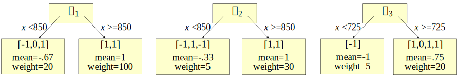

# Gradient boosting: Heading in the right direction

\author{[Terence Parr](http://parrt.cs.usfca.edu) and [Jeremy Howard](http://www.fast.ai/about/#jeremy)}

In our previous article, <a href="L2-loss.html">Gradient boosting: Distance to target</a>, our model took steps towards the target $\vec y$ based upon the difference vector, $\vec y-F_m(X)$, which includes the magnitude not just the direction of $\vec y$ from our current mode $F_m(X)$. The difference vector makes the $F_m$ composite models converge rapidly towards $\vec y$.  The negative, of course, is that using the magnitude makes the composite model chase outliers.   This occurs because mean computations are easily skewed by outliers and our regression tree stubs yield predictions using the mean of all target values in a leaf.  For noisy target variables, it makes more sense to step merely in the *direction* of $\vec y$ from $F_m$ rather than the magnitude and direction. 

This brings us to the second commonly-used vector with gradient boosting, the direction vector $sign(y_i-F_m(\vec x_i))$, which is either -1, 0, or +1 for each observation $\vec x_i$.   No matter how distant the true target is from our current prediction, the vector used to take steps towards the target is just the direction without the magnitude. If there are outliers in the target variable that we cannot remove, using just the direction is better than both direction and magnitude. We'll show in <a href="descent.html">Gradient boosting performs gradient descent</a> that using $sign(y-F_m(\vec x_i))$ as our step vector leads to a solution that optimizes the model according to the mean absolute value (MAE) or $L_1$  *loss function*: $\sum_{i=1}^{N} |y_i - F_M(\vec x_i)|$. 

Optimizing the MAE means we should start with the median, not the mean, as our initial model, $f_0$, since the median of $y$ minimizes the $L_1$ loss. (It's the best single-value approximation.)  Other than that, we can start out with the same recurrence relations for finding composite model $F_m(\vec x)$ as we did for the different sector version in the last article:

\latex{{
\begin{eqnarray*}
F_0(\vec x) &=& f_0(\vec x)\\
F_m(\vec x) &=& F_{m-1}(\vec x) + w_m \Delta_m(\vec x)\\
\end{eqnarray*}
}}

Recall that $F_m(\vec x)$ yields a predicted value but $F_m(X)$ yields a predicted target vector, one value for each $\vec x$ feature vector.

So the equation for $F_0$ is the same:

\[
F_0(\vec x) = f_0(\vec x)
\]

and we could use the equation used for $y-\hat y$ direction vectors for obtaining new composite models from the previous:

\[
F_m(\vec x) = F_{i-1}(\vec x) + w_m \Delta_m(\vec x)\\
\]

but we would need very small weights, $w_m$, or a very small learning rate to avoid oscillating around the solution instead of converging to it.

\[
F_m(\vec x) = F_{i-1}(\vec x) + \Delta_m(\vec x; \vec w_m)\\
\]

Wow. leaves have diff weights for CARTs. only seem to need for MAE version. so the usual math eqn isn't what's done in practice. weak models don't repro dir vector well enough I guess. \todo{ can mention momentum instead of or in addition to leaf weights.  see accelerated gradient boosting paper recently.}

\todo{short arrows look like markers on the first image}

\todo{Fix axes so they say rent and square feet not X and Y}

\todo{Use line not dot in legend for red lines}

<pyeval label="examples" hide=true>
import pandas as pd
import matplotlib.pyplot as plt
from matplotlib import rc
import matplotlib
import numpy as np
from scipy.optimize import minimize_scalar
from sklearn.metrics import mean_squared_error, mean_absolute_error
#rc('text', usetex=True)
matplotlib.rcParams['mathtext.fontset'] = 'cm'
matplotlib.rcParams['mathtext.rm'] = 'serif'
matplotlib.rc('xtick', labelsize=13) 
matplotlib.rc('ytick', labelsize=13) 

bookcolors = {'crimson': '#a50026', 'red': '#d73027', 'redorange': '#f46d43',
              'orange': '#fdae61', 'yellow': '#fee090', 'sky': '#e0f3f8', 
              'babyblue': '#abd9e9', 'lightblue': '#74add1', 'blue': '#4575b4',
              'purple': '#313695'}

def draw_vector(ax, x, y, dx, dy, yrange):
    ax.plot([x,x+dx], [y,y+dy], c='r', linewidth=.8)
    ay = y+dy
    yrange *= 0.03
    ad = -yrange if dy>=0 else yrange
    ax.plot([x+dx-4,x+dx], [ay+ad,ay], c='r', linewidth=.8)
    ax.plot([x+dx,x+dx+4], [ay,ay+ad], c='r', linewidth=.8)
</pyeval>

<pyeval label="examples" output="df" hide=true>
def data():
    df = pd.DataFrame(data={"sqfeet":[700,950,800,900,750]})
    df["rent"] = pd.Series([1125,1350,1135,1300,1150])
    df = df.sort_values('sqfeet')
    return df

df = data()
</pyeval>

<pyeval label=mae hide=true>
import pandas as pd
import matplotlib.pyplot as plt
from matplotlib import rc
import matplotlib
import numpy as np
from scipy.optimize import minimize_scalar
from sklearn.metrics import mean_squared_error, mean_absolute_error
#rc('text', usetex=True)
matplotlib.rcParams['mathtext.fontset'] = 'cm'
matplotlib.rcParams['mathtext.rm'] = 'serif'
matplotlib.rc('xtick', labelsize=13) 
matplotlib.rc('ytick', labelsize=13) 

bookcolors = {'crimson': '#a50026', 'red': '#d73027', 'redorange': '#f46d43',
              'orange': '#fdae61', 'yellow': '#fee090', 'sky': '#e0f3f8', 
              'babyblue': '#abd9e9', 'lightblue': '#74add1', 'blue': '#4575b4',
              'purple': '#313695'}

def data():
    df = pd.DataFrame(data={"sqfeet":[700,950,800,900,750]})
    df["rent"] = pd.Series([1125,1350,1135,1300,1150])
    df = df.sort_values('sqfeet')
    return df
df = data()
</pyeval>

<pyeval label=mae hide=true>
def stub_predict(x_train, y_train, split):
    left = y_train[x_train<split]
    right = y_train[x_train>split]
    lmean = np.mean(left)
    rmean = np.mean(right)    
#     lw,rw = w
    lw,rw = 1,1
    return np.array([lw*lmean if x<split else rw*rmean for x in x_train])

eta = 1.0
splits = [None,850, 850, 725] # manually pick them
w = [None, (20,100), (5,30), (5,20)]
stages = 4

def boost(df, xcol, ycol, splits, eta, stages):
    """
    Update df to have direction_m, delta_m, F_m.
    Return MSE, MAE
    """
    f0 = df[ycol].median()
    df['F0'] = f0

    for s in range(1,stages):
        # print("Weight", w[s])
        df[f'dir{s}'] = np.sign(df[ycol] - df[f'F{s-1}'])
        df[f'delta{s}'] = stub_predict(df[xcol], df[f'dir{s}'], splits[s])
        weights = np.array([w[s][0] if x<splits[s] else w[s][1] for x in df[xcol]])
        df[f'wdelta{s}'] = df[f'delta{s}'] * weights
        df[f'F{s}'] = df[f'F{s-1}'] + eta * df[f'wdelta{s}']

    mse = [mean_squared_error(df[ycol], df['F'+str(s)]) for s in range(stages)]
    mae = [mean_absolute_error(df[ycol], df['F'+str(s)]) for s in range(stages)]
    return mse, mae

mse,mae = boost(df, 'sqfeet', 'rent', splits, eta, stages)
df['deltas'] = df[['delta1','delta2','delta3']].sum(axis=1) # sum deltas
</pyeval>

<!-- rent vs x -->

<pyfig label=mae hide=true width="62%">
f0 = df.rent.median()
fig, axes = plt.subplots(nrows=1, ncols=2, figsize=(8, 4), sharey=True)

ax = axes[0]
line1, = ax.plot(df.sqfeet,df.rent,'o', linewidth=.8, markersize=4, label="$y$")
# fake a line to get smaller red dot
line2, = ax.plot(0,0,'o', c='r', markersize=4, label=r"$sign(y-f_0({\bf x}))$")
ax.plot([df.sqfeet.min()-10,df.sqfeet.max()+10], [f0,f0],
         linewidth=.8, linestyle='--', c='k')
ax.set_xlim(df.sqfeet.min()-10,df.sqfeet.max()+10)
ax.set_ylim(df.rent.min()-10, df.rent.max()+20)
ax.text(815, f0+10, r"$f_0({\bf x})$", fontsize=18)

ax.set_ylabel(r"Rent $y$", fontsize=20)
ax.set_xlabel(r"${\bf x}$", fontsize=20)

# draw arrows
for x,y,yhat in zip(df.sqfeet,df.rent,df.F0):
    if y-yhat!=0:
        ax.arrow(x, yhat, 0, np.sign(y-yhat), # NO WEIGHT
                  fc='r', ec='r',
                  linewidth=0.8,
                  head_width=6, head_length=6
                 )
ax.legend(handles=[line1,line2], fontsize=16,
          loc='upper left', 
          labelspacing=.1,
          handletextpad=.2,
          handlelength=.7,
          frameon=True)

def draw_stage_residual(ax, df, stage):
    for x,d0,delta in zip(df.sqfeet,df[f'F{stage-1}'],df[f'F{stage}']):
        if delta-d0!=0:
#             print(x, d0, delta)
            ax.arrow(x, d0, 0, delta-d0,
                      fc='r', ec='r',
                      linewidth=0.8,
                      head_width=4, head_length=4,  
                      length_includes_head=True
                     )

ax = axes[1]
# plot from F0 to F1 to F2 to F3
line1, = ax.plot(df.sqfeet,df.rent,'o', linewidth=.8, markersize=4, label="$y$")
draw_stage_residual(ax, df, stage=1)
draw_stage_residual(ax, df, stage=2)
arrow = draw_stage_residual(ax, df, stage=3)
# fake a line to get smaller red dot
line2, = ax.plot(700,1000,'o', c='r', markersize=4, label=r"$w_1sign(y-f_0({\bf x}))$")
ax.plot([df.sqfeet.min()-10,df.sqfeet.max()+10], [f0,f0],
         linewidth=.8, linestyle='--', c='k')
ax.text(815, f0+10, r"$f_0({\bf x})$", fontsize=18)
ax.legend(handles=[line1,line2], fontsize=16,
          loc='upper left', 
          labelspacing=.1,
          handletextpad=.2,
          handlelength=.7,
          frameon=True,
          labels=["$y$","Weighted $\Delta_i({\\bf x})$"])

plt.tight_layout()
plt.savefig('/tmp/s.svg')
plt.show()
</pyfig>

<!-- Plot delta predictions versus residuals -->

<pyfig label=mae hide=true width="90%">
def draw_stub(ax, x_train, y_train, y_pred, split, stage, locs):
    line1, = ax.plot(x_train, y_train, 'o',
                     markersize=4,
                     label=f"$sign(y-F_{stage-1})$")
    label = r"$\Delta_"+str(stage)+r"({\bf x})$"
    left = y_pred[x_train<split]
    right = y_pred[x_train>split]
    lmean = np.mean(left)
    rmean = np.mean(right)
    line2, = ax.plot([x_train.min()-10,split], [lmean,lmean],
             linewidth=.8, linestyle='--', c='k', label=label)
    ax.plot([split,x_train.max()+10], [rmean,rmean],
             linewidth=.8, linestyle='--', c='k')
    ax.plot([split,split], [lmean,rmean],
             linewidth=.8, linestyle='--', c='k')
    ax.plot([x_train.min()-10,x_train.max()+10], [0,0],
             linewidth=.8, linestyle=':', c='k')
    ax.legend(handles=[line1,line2], fontsize=16,
              loc=locs[stage-1], 
              labelspacing=.1,
              handletextpad=.2,
              handlelength=.7,
              frameon=True)

def draw_residual(ax, df, stage):
    for x,d0,delta in zip(df.sqfeet,df[f'dir{stage}'],df[f'delta{stage}']):
        if delta-d0!=0:
#             print(x, d0, delta)
            ax.arrow(x, d0, 0, delta-d0,
                      fc='r', ec='r',
                      linewidth=0.8,
                     )

fig, axes = plt.subplots(nrows=1, ncols=3, figsize=(10, 3.5), sharey=True, sharex=True)

ax = axes[0]
axes[0].set_ylabel(r"Direction in {-1,0,1}", fontsize=15)
axes[0].set_yticks([-1,0,1])
for a in range(3):
    axes[a].set_xlabel(r"${\bf x}$", fontsize=20)

locs = ['upper left','center right','lower right']
draw_stub(axes[0], df.sqfeet, df.dir1, df.delta1, splits[1], stage=1, locs=locs)
draw_residual(axes[0], df, stage=1)

draw_stub(axes[1], df.sqfeet, df.dir2, df.delta2, splits[2], stage=2, locs=locs)
draw_residual(axes[1], df, stage=2)

draw_stub(axes[2], df.sqfeet, df.dir3, df.delta3, splits[3], stage=3, locs=locs)
draw_residual(axes[2], df, stage=3)

plt.tight_layout()
        
plt.savefig('/tmp/t.svg')
plt.show()
</pyfig>

\todo{show  Delta one and Delta to then Delta two and Delta three}

<!-- composite model -->

<pyfig label=mae hide=true width="45%">
df = data()
eta = 1
mse,mae = boost(df, 'sqfeet', 'rent', splits, eta, stages)
df['deltas'] = eta * df[['wdelta1','wdelta2','wdelta3']].sum(axis=1) # sum deltas
df[['sqfeet','rent','F0','wdelta1','wdelta2','wdelta3','deltas','F3']]

# Iterate through F3, finding split points in predicted rent
# and create coordinate list to draw lines
split_x_locs = []
x_prev = np.min(df.sqfeet)
y_prev = np.min(df.F3)
X = df.sqfeet.values
coords = []
for i,y_hat in enumerate(df.F3.values):
    if y_hat!=y_prev:
        mid = (X[i]+X[i-1])/2
        coords.append((mid,y_prev))
        coords.append((mid,y_hat))
        coords.append((X[i],y_hat))
    else:
        coords.append((X[i],y_hat))
    y_prev = y_hat

fig, ax = plt.subplots(nrows=1, ncols=1, figsize=(6.1, 3))

line1, = ax.plot(df.sqfeet,df.rent, 'o', label=r'$y$')

prev = None
for x,y in coords:
    if prev is not None:
        line2, = ax.plot([prev[0],x], [prev[1],y], linewidth=.8,
                         linestyle='--', c='k',
                         label=r"$f_0 + \eta (\Delta_1+\Delta_2+\Delta_3)$")
    prev = (x,y)

ax.set_ylabel(r"Rent", fontsize=16)
ax.set_xlabel(r"${\bf x}$", fontsize=20)

ax.set_yticks(np.arange(1150,1351,50))

ax.legend(handles=[line1,line2], fontsize=16,
          loc='upper left', 
          labelspacing=.1,
          handletextpad=.2,
          handlelength=.7,
          frameon=True)

plt.tight_layout()
plt.show()
</pyfig>

Now show addition of all terms, dsashed lines, visually.

$\hat y = f_0(\vec x) + \Delta_1(\vec x) + \Delta_2(\vec x) + ...  + \Delta_M(\vec x)$

That's easy enough, so what's the problem? How do we know this procedure is correct and terminates? Why do they call it gradient boosting?

we add together the results of multiple weak learners

How good is that model? To answer that, we need a loss or cost function, $L(y,\hat y)$, that computes the cost of predicting $\hat y$ instead of $y$.  The squared error, $L(y,\hat y) = (y-\hat y)^2$ is the most common, but sometimes we care more about the absolute difference, $L(y,\hat y) = |y-\hat y|$. The loss across all observations is just the sum (or the average if you want to divide by $N$) of all the individual observation losses:

\[
L(\vec y, X) = \sum_{i=1}^{N} L(y_i, F_M(\vec x_i))
\]

That gives this either $L(\vec y, X) = \sum_{i=1}^{N} (y_i - F_M(\vec x_i))^2$ or $L(\vec y, X) = \sum_{i=1}^{N} |y_i - F_M(\vec x_i)|$.

Have you ever wondered why this technique is called *gradient* boosting? We're boosting gradients because our weak models learn direction vectors, and the other common term for "direction vector" is, drumroll please, *gradient*.  that leads us to optimization via gradient descent.
