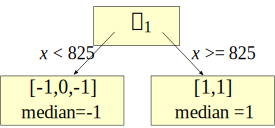
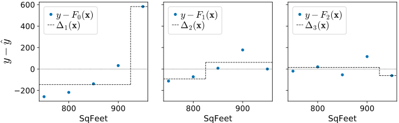

# Gradient boosting: Heading in the right direction

\author{[Terence Parr](http://parrt.cs.usfca.edu) and [Jeremy Howard](http://www.fast.ai/about/#jeremy)}

In our previous article, <a href="L2-loss.html">Gradient boosting: Distance to target</a>, our model took steps towards the target $\vec y$ based upon the residual vector, $\vec y-F_{m-1}(X)$, which includes the magnitude not just the direction of $\vec y$ from our the previous composite model's prediction, $F_{m-1}(X)$. The residual vector makes composite models converge rapidly towards $\vec y$.  The negative, of course, is that using the magnitude makes the composite model chase outliers.   This occurs because mean computations are easily skewed by outliers and our regression tree stumps yield predictions using the mean of all target values in a leaf.  For noisy target variables, it makes more sense to focus on the *direction* of $\vec y$ from $F_{m-1}$ rather than the magnitude and direction. 

## Chasing the sign vector

This brings us to the second commonly-used vector with gradient boosting, which we can call the *sign vector*: $sign(y_i-F_{m-1}(\vec x_i))$. The sign vector elements are either -1, 0, or +1, one value for each observation $\vec x_i$.   No matter how distant the true target is from our current prediction, we'll train weak models using direction info without the magnitude.  This sign vector is a bit weird, though, because the vector elements are limited to -1, 0, or +1.  In two dimensions, for example, such vectors can only point at multiples of 45 degrees (0, 45, 90, 135, ...) and so the sign vector will rarely point directly at the target. Just to be clear, the sign vector is not the unit vector in the direction of $y_i-F_{m-1}(\vec x_i)$.

If there are outliers in the target variable that we cannot remove, using just the direction is better than both direction and magnitude. We'll show in <a href="descent.html">Gradient boosting performs gradient descent</a> that using $sign(y-F_{m-1}(\vec x_i))$ as our step vector leads to a solution that optimizes the model according to the mean absolute value (MAE) or $L_1$  *loss function*: $\sum_{i=1}^{N} |y_i - F_M(\vec x_i)|$ for $N$ observations. 

Optimizing the MAE means we should start with the median, not the mean, as our initial model, $f_0$, since the median of $y$ minimizes the $L_1$ loss. (The median is the best single-value approximation of $L_1$ loss.)  Other than that, we use the same recurrence relations to compute composite models based upon the sign of the residual vector:

\latex{{
\begin{eqnarray*}
F_0(\vec x) &=& f_0(\vec x)\\
F_m(\vec x) &=& F_{m-1}(\vec x) + \eta \Delta_m(\vec x)\\
\end{eqnarray*}
}}

Let's assume $\eta = 1$ so that it drops out of the equation to simplify our discussion, but keep in mind that it's an important hyper-parameter you need to set in practice.  Recall that $F_m(\vec x)$ yields a predicted value, $y_i$, but $F_m(X)$ yields a predicted target vector, $\vec y$, one value for each $\vec x_i$ feature row-vector in matrix $X$. 

Here is the rental data again along with the initial $F_0$ model (median of $\vec y$), the first residual, and the first sign vector:

\latex{{
{\small
\begin{tabular}[t]{rrrrr}
{\bf sqfeet} & {\bf rent} & $F_0$ & $\vec y$-$F_0$ & $sign(\vec y$-$F_0)$ \\
\hline
750 & 1160 & 1280 & -120 & -1\\
800 & 1200 & 1280 & -80 & -1\\
850 & 1280 & 1280 & 0 & 0\\
900 & 1450 & 1280 & 170 & 1\\
950 & 2000 & 1280 & 720 & 1\\
\end{tabular}
}
}}

<pyeval label="examples" hide=true>
from support import *		  		
df = data()

M = 3
eta = 1
gbm = l1boost(df, 'rent', eta, M)
splits = gbm.splits()

mse = [mean_squared_error(df.rent, df['F'+str(s)]) for s in range(M+1)]
mae = [mean_absolute_error(df.rent, df['F'+str(s)]) for s in range(M+1)]
#print(mse)
#print(mae)
</pyeval>

Visually, we can see that the first sign vector has components pointing in the right direction of the true target elements, $y_i$, from $f_0(X)$:
 
<pyfig label=examples hide=true width="32%">
f0 = df.rent.median()
fig, axes = plt.subplots(nrows=1, ncols=1, figsize=(4, 3.5), sharey=True)

ax = axes
line1, = ax.plot(df.sqfeet,df.rent,'o', linewidth=.8, markersize=4, label="$y$")
# fake a line to get smaller red dot
line2, = ax.plot([0,0],[0,0], c='r', markersize=4, label=r"$sign(y-f_0({\bf x}))$", linewidth=.8)
ax.plot([df.sqfeet.min()-10,df.sqfeet.max()+10], [f0,f0],
         linewidth=.8, linestyle='--', c='k')
ax.set_xlim(df.sqfeet.min()-10,df.sqfeet.max()+10)
ax.set_ylim(df.rent.min()-30, df.rent.max()+30)
ax.text(830, f0-80, r"$f_0({\bf x})$", fontsize=18)

ax.set_ylabel(r"Rent ($y$)", fontsize=14)
ax.set_xlabel(r"SqFeet (${\bf x}$)", fontsize=14)

# draw arrows
for x,y,yhat in zip(df.sqfeet,df.rent,df.F0):
    if np.sign(y-yhat)==0:
        # draw up/down to get X on 0
        draw_vector(ax, x, yhat, 0, -2, df.rent.max()-df.rent.min())
        draw_vector(ax, x, yhat, 0, 2, df.rent.max()-df.rent.min())
    else:
        draw_vector(ax, x, yhat, 0, np.sign(y-yhat)*2, df.rent.max()-df.rent.min())
    
ax.legend(handles=[line2], fontsize=16,
          loc='upper left', 
          labelspacing=.1,
          handletextpad=.2,
          handlelength=.7,
          frameon=True)

plt.tight_layout()
plt.show()
</pyfig>

## Two perspectives on training weak models for L1 loss

As we did in the first article, our goal is to create a series of nudges, $\Delta_m$, that gradually shift our initial approximation, $f_0(X)$, towards the true target rent vector, $\vec y$. The first stump, $\Delta_1$, should be trained on $sign(\vec y - F_0(X))$, as opposed to the residual vector itself, and let's choose a split point of 850 because that groups the sign values into two similar (low variance) groups, $[-1, 0, 1]$ and $[1,1]$. Because we are dealing with $L_1$ absolute difference and not $L_2$ squared difference, stumps should predict the median, not the mean, of the observations in each leaf. That means $\Delta_1$ would predict -1 for $\vec x$\<825 and 1 for $\vec x$>=825:
	
  

Without the distance to the target as part of our $\Delta_m$ nudges, however, the composite model $F_m(X)$ would step towards rent target vector $\vec y$ very slowly, one dollar at a time per observation. We need to weight the $\Delta_m$ predictions so that the algorithm takes bigger steps. Unfortunately, we can't use a single weight per stage, like $w_m \Delta_m(\vec x)$, because it might force the composite model predictions to oscillate around but never reach an accurate prediction. A global weight per stage is just too coarse to allow tight convergence to $\vec y$ for all $\hat y_i$ simultaneously. For example, if we set $w_1=100$ to get the fourth and fifth data points from 1150 to 1250 in one step, that would also push the other points very far below their true targets:

<pyfig label=examples hide=true width="32%">
f0 = df.rent.median()
fig, axes = plt.subplots(nrows=1, ncols=1, figsize=(4, 3.5), sharey=True)

ax = axes
line1, = ax.plot(df.sqfeet,df.rent,'o', linewidth=.8, markersize=4, label="$y$")
# fake a line to get smaller red dot
line2, = ax.plot([0,0],[0,0], c='r', markersize=4, label=r"$100 \Delta_1({\bf x})$", linewidth=.8)
ax.plot([df.sqfeet.min()-10,df.sqfeet.max()+10], [f0,f0],
         linewidth=.8, linestyle='--', c='k')
ax.set_xlim(df.sqfeet.min()-10,df.sqfeet.max()+10)
ax.set_ylim(df.rent.min()-150, df.rent.max()+20)
ax.text(800, f0+30, r"$f_0({\bf x})$", fontsize=18)

ax.arrow(880,f0-100, -20, 0, linewidth=.8, head_width=6, head_length=4)
ax.text(883, f0-100-15, "Oops!", fontsize=12)

ax.set_ylabel(r"Rent ($y$)", fontsize=14)
ax.set_xlabel(r"SqFeet (${\bf x}$)", fontsize=14)

# draw arrows
for x,y,yhat in zip(df.sqfeet,df.rent,df.F0):
    draw_vector(ax, x, yhat, 0, (np.sign(y-yhat) if y-yhat>0 else -1)*100, df.rent.max()-df.rent.min())
    
ax.legend(handles=[line2], fontsize=16,
          loc='upper left', 
          labelspacing=.1,
          handletextpad=.2,
          handlelength=.7,
          frameon=True)

plt.tight_layout()
plt.show()
</pyfig>

When training weak models on the residual vector, in the first article, each regression tree leaf predicted the average residual for observations in that leaf. Such a prediction tries to place the next $F_m$ output in the middle of the $y_i$ of those observations.  That gives us a hint that we should use a weight per leaf to scale the predictions trained on the sign vector, but how do we compute those weights? 

The graph of rent versus sqfeet clearly shows that we need a small weight for the left stump leaf and a much larger weight for the right stump leaf. The goal should be to have the next $F_1$ model step into the middle of the $y$ rent values in each group (leaf) of observations, which means jumping to the median $y$ in each group. Again, we use the median not the mean because our overall model is trying to minimize the $L_1$ loss. The weight we need for each leaf is the magnitude of the difference between $f_0$ and the median $y$ for each leaf group. This value is the median of the $abs(y_i - f_0(\vec x_i))$ residuals restricted to observations $i$ in the leaf. The sign vector already has the direction, which is why we use the absolute value of the median (our weights in this case are always positive). 

Equivalently, we can think of this process as having each stump leaf predict the median residual of the observations in that leaf (in which case we don't need the absolute value). Without alteration, the stump leaves would predict the average residual as usual, not the median. This fact makes the MSE and MAE approaches seem nearly identical. That's a bit weird and an incredibly subtle point, so let's emphasize it in a callout:

<aside title="The difference between MSE and MAE GBM trees">

GBMs that optimize  MSE ($L_2$ loss) and MAE ($L_1$ loss) both train regression trees, $\Delta_m$, on direction vectors.  The first difference between the approaches is that MSE trains trees on residual vectors and MAE trains trees on sign vectors. The goal of training the tree is to group similar observations into leaf nodes in both cases.  Because they are training on different vectors (residuals versus signs), the trees will group the observations in the training data differently. The actual training of the weak model trees always computes split points by trying to minimize the squared difference of target values within the two groups, even in the MAE case.  The second difference is that an MSE tree leaf predicts the average of the residuals, $y_i - F_{m-1}(\vec x_i)$, values for all $i$ observations in that leaf whereas an MAE tree leaf predicts the median of the residual. Both are predicting residuals. Weird, right?

Just to drive this home, MSE trains on residual vectors and the leaves predict the average residual. MAE trains on sign vectors, but the leaves predict residuals like MSE, albeit the median, not the average residual. It's weird because models don't typically train on one space (sign values) and predict values in a different space (residuals). It's perhaps easier to think of MAE as training on sign vectors and predicting sign values (-1, 0, +1) but then weighting that prediction by the absolute value of the median of the residuals.

</aside>

Let's figure out the weights for the leaves of $F_1$'s stump. The residual vector $\vec y - F_0$ has values -25, 0, -15 for the left leaf, which has a median of 15, so that is the weight for the left leaf. The right leaf has residuals 150 and 200, so the weight of the right leaf is 175.  The dashed line in the following graph shows composite model $F_1$.

<pyeval label=examples hide=true>
# get left/right median to use as weights
t1 = gbm.stumps[0]
w1 = int(np.abs(t1.predict(t1.split-1)))
w2 = int(np.abs(t1.predict(t1.split+1)))
</pyeval>

<pyfig label=examples hide=true width="40%">
fig, ax = plt.subplots(nrows=1, ncols=1, figsize=(5,4))

plot_composite(ax, df, gbm, 1, eta=1.0, legend=False)

ax.plot([df.sqfeet.min()-10,df.sqfeet.max()+10], [f0,f0],
         linewidth=.8, linestyle=':', c='k')

for x,d0,delta in zip(df.sqfeet,df[f'F0'],df[f'F1']):
    draw_vector(ax, x, d0, 0, delta-d0, df.rent.max()-df.rent.min())

ax.text(750, 1800, r"$F_1 = f_0 + \Delta_1({\bf x}; {\bf w}_1)$", fontsize=18)
ax.text(750, 1710, r"${\bf w}_1 = ["+str(w1)+","+str(w2)+"]$", fontsize=16)
ax.text(910, f0-60, r"$f_0({\bf x})$", fontsize=18)

ax.set_ylabel(r"Rent ($y$)", fontsize=14)
ax.set_xlabel(r"SqFeet (${\bf x}$)", fontsize=14)
ax.set_xlim(df.sqfeet.min()-10,df.sqfeet.max()+10)

ax.text(800,1980, "$\Delta_1$ for $L_1$ ignores outlier", fontsize=14)
plt.tight_layout()

plt.show()
</pyfig>

This graph uses notation that assumes an interpretation of weighted stump leaves that predict sign values, $\Delta_m(\vec x; \vec w_m)$.  We can drop the extra $\vec w_m$ notation for the remainder of this discussion if we interpret the $\Delta_m$ models as training on sign vectors but yielding the median of the observations in each leaf.

Here are the intermediate results of residuals and weak learners for the $M=3$ case (with learning rate $\eta=1$):

\latex{{
{\small
\setlength{\tabcolsep}{0.5em}
\begin{tabular}[t]{rrrrrrrrrrr}
&&& $sign$ &&&& $sign$\vspace{-1mm}\\  
$\Delta_1$ & $F_1$ & $\vec y$-$F_1$ & $\vec y$-$F_1$ & $\Delta_2$ & $F_2$ & $\vec y$-$F_2$ & $\vec y$-$F_2$ & $\Delta_3$ & $F_3$\\
\hline
-100 & 1180 & -20 & -1 & -20 & 1160 & 0 & 0 & -5 & 1155\\
-100 & 1180 & 20 & 1 & 10 & 1190 & 10 & 1 & -5 & 1185\\
170 & 1450 & -170 & -1 & 10 & 1460 & -180 & -1 & -5 & 1455\\
170 & 1450 & 0 & 0 & 10 & 1460 & -10 & -1 & -5 & 1455\\
170 & 1450 & 550 & 1 & 10 & 1460 & 540 & 1 & 540 & 2000\\
\end{tabular}
}
}}

The split points are 825, 775, 925 for the $\Delta_m$ models. Here are the resulting stumps:

Let's look at the $y - F_m$ residuals and the $\Delta_m$ models trained on the sign vectors and weighted by the median of the residuals in the enclosing leaf node.

<table>
<tr><th>$\Delta_m$ for MAE $L_1$ optimization
<tr>
<td>
<pyfig label=examples hide=true width="90%">
fig, axes = plt.subplots(nrows=1, ncols=3, figsize=(10, 3.5), sharey=True)

axes[0].set_ylabel(r"$y-\hat y$", fontsize=20)
for a in range(3):
    axes[a].set_xlabel(r"SqFeet", fontsize=14)
    axes[a].set_xlim(df.sqfeet.min()-10,df.sqfeet.max()+10)

plot_stump(axes[0], df.sqfeet, df.res1, df.delta1, splits[0], stage=1)
plot_stump(axes[1], df.sqfeet, df.res2, df.delta2, splits[1], stage=2)
plot_stump(axes[2], df.sqfeet, df.res3, df.delta3, splits[2], stage=3)

plt.tight_layout()
plt.show()
</pyfig>
</table>

The blue dots are the residual vector elements whose sign value is used to train $\Delta_m$ weak models, the dashed lines are the predictions made by $\Delta_m$, and the dotted line is the origin at 0. The residual vector elements get closer to zero in general as they did in the previous article (that trained on the residual not sign vector). In this case, however, the weak models are clearly not chasing the outlier with prejudice, which is finally dealt with using $\Delta_3$. In contrast, the $L_2$-optimizing model from the previous article used $\Delta_1$ to immediately bring that outlier residual to 0 (as shown in $y-F_1$ residual):

<table>
<tr><th>$\Delta_m$ for MSE $L_2$ optimization
<tr>
<td>

</table>

Despite the imprecision of the weak models, the weighted $\Delta_m$ predictions nudge $\hat{\vec y}$ closer and closer to the true $\vec y$. It's also helpful to look at a sequence of diagrams showing the composite model predictions as we add weak models:

<!-- composite model -->

<pyfig label=examples hide=true width="90%">
fig, axes = plt.subplots(nrows=1, ncols=3, figsize=(11.1, 3.5), sharey=True)

axes[0].set_ylabel(r"Rent", fontsize=14)
for a in range(3):
    axes[a].set_xlabel(r"SqFeet", fontsize=14)
    axes[a].set_xlim(df.sqfeet.min()-10,df.sqfeet.max()+10)

plot_composite(axes[0], df, gbm, 1)
plot_composite(axes[1], df, gbm, 2)
plot_composite(axes[2], df, gbm, 3)

plt.tight_layout()
plt.show()
</pyfig>

How accurate is $F_M(\vec x)$? As in the previous article, we can use a loss function $L(\vec y,\hat{\vec y})$, that computes the cost of predicting $\hat{\vec y}$ instead of $\vec y$.  Because we are worried about outliers in this article, it's appropriate to use the mean absolute error (MAE) as our loss function:

\[
L(\vec y,F_M(X)) = \frac{1}{N} \sum_{i=1}^{N} |y_i - F_M(\vec x_i)|
\]

Ok, so now we've looked at two similar GBM construction approaches, one that trains weak models on residual vectors and the other that trains weak models on sign vectors. The former predicts the average residual value for observations in the leaf associated with an unknown $\vec x$ whereas the latter predicts the median residual value. The effect of these differences is that the former optimizes the mean squared error and the latter optimizes the mean absolute error over the training set. Why this is true is the focus of the next article and final article, [Gradient boosting performs gradient descent](descent.html).

## GBM algorithm to minimize L1 loss

For completeness, here is the boosting algorithm that optimizes the $L_1$ loss function using regression tree stumps:

\latex{{
\setlength{\algomargin}{3pt}
\SetAlCapSkip{-10pt}
\begin{algorithm}[H]
\LinesNumbered
\SetAlgorithmName{Algorithm}{List of Algorithms}
\SetAlgoSkip{}
\SetInd{.5em}{.5em}
\TitleOfAlgo{{\em l1boost}($X$,$\vec y$,$M$,$\eta$) {\bf returns} model $F_M$}
Let $F_0(X) = median(\vec y)$\\
\For{$m$ = 1 \KwTo $M$}{
	Let $\delta_m = \vec y - F_{m-1}(X)$ be the residual vector\\
	Let ${\bf sign}_m = sign(\delta_m)$ be the sign vector\\
	Train regression tree $\Delta_m$ on ${\bf sign}_m$, minimizing squared error\\
	\ForEach{leaf $l \in \Delta_m$}{
		Alter $l$ to predict median (not mean) of $y_i - F_{m-1}(x_i)$ for obs. $i$ in $l$\\
	}
	$F_m(X) = F_{m-1}(X) + \eta \Delta_m(X)$\\
}
\Return{$F_M$}\\
\end{algorithm}
}}

