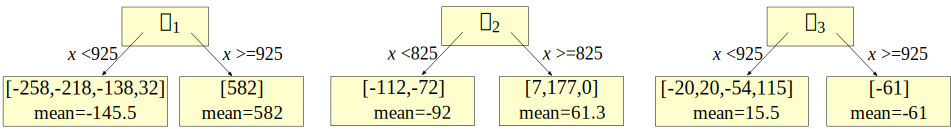
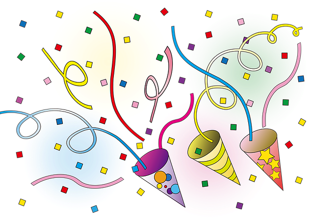

# Gradient boosting: Distance to target

\author{[Terence Parr](http://parrt.cs.usfca.edu) and [Jeremy Howard](http://www.fast.ai/about/#jeremy)}

## An introduction to boosted regression

[Boosting](https://en.wikipedia.org/wiki/Boosting_\(meta-algorithm\)) is a loosely-defined strategy for combining the efforts of multiple weak models into a single, strong meta-model or composite model.   Mathematicians represent both the weak and composite models as functions, but in practice the models can be anything including k-nearest-neighbors or regression trees.  Since everyone uses trees for boosting, we'll focus on implementations that use regression trees for weak models, which also happens greatly simplifies the mathematics. Given a single feature vector $\vec x$ and scalar target value $y$ from a single observation, we can express a meta-model that predicts $\hat y$ as the addition of $M$ weak models $f_m(\vec x)$:

\[
\hat y = F_M(\vec x) = f_1(\vec x) + ...  + f_M(\vec x) = \sum_{m=1}^M f_m(\vec x)
\]

In practice, we always have more than one observation, ($\vec x_i$, $y_i$), but it's easier to start out thinking about how to deal with a single observation. Later, we'll stack $N$ feature vectors as rows in a matrix, $X = [\vec x_1, \vec x_2, ..., \vec x_N]$, and targets into a vector, $\vec y = [y_1, y_2, ..., y_N]$ for $N$ observations.

Mathematicians call this "additive modeling" and electrical engineers use it for decomposing signals into a collection of sine waves representing the frequency components (insert terrifying flashback to Fourier analysis here.) 

It's often the case that an additive model can build the individual $f_m(\vec x)$ terms independently and in parallel, but that's not the case for boosting. Boosting constructs and adds weak models in a stage-wise fashion, one after the other, each one chosen to improve the overall model performance. The boosting strategy is greedy in the sense that choosing $f_m(\vec x)$ never alters previous functions. We could choose to stop adding weak models when $\hat y = F_M(\vec x)$'s performance is good enough or when $f_m(\vec x)$ doesn't add anything.   In practice, we choose the number of stages, $M$, as a hyper-parameter of the overall model. Allowing $M$ to grow arbitrarily increases the risk of over fitting.

Because greedy strategies choose one weak model at a time, you will often see boosting models expressed using this equivalent, recursive formulation:

\[
F_m(\vec x) = F_{m-1} + f_m(\vec x)
\]

That says we should tweak the previous model with $f_m(\vec x)$ to get the next model. 

Boosting itself does not specify how to choose the weak learners.  Boosting does not even specify the form of the $f_m(\vec x)$ models, but the form of the weak model dictates the form of the meta-model. For example, if all weak models are linear models, then the resulting meta-model is a simple linear model. If we use tiny regression trees as the weak models, the result is a forest of trees whose predictions are added together.

Let's see if we can design a strategy for picking weak models to create our own boosting algorithm for a single observation. Then, we can extend it to work on the multiple observations we'd encounter in practice.

## The intuition behind gradient boosting

To construct a boosted regression model, let's start by creating a crappy model, $f_0(\vec x)$, that predicts an initial approximation of $y$ given feature vector $\vec x$. Then, let's gradually nudge the overall $F_m(\vec x)$ model towards the known target value $y$ by adding one or more tweaks, $\Delta_m(\vec x)$:

\latex{{
\begin{eqnarray*}
\hat y & = & f_0(\vec x) + \Delta_1(\vec x) + \Delta_2(\vec x) + ...  +  \Delta_M(\vec x) \\
 & = & f_0(\vec x) + \sum_{m=1}^M  \Delta_m(\vec x)\\
 & = & F_M(\vec x)\\
\end{eqnarray*}
}}

Or, using a recurrence relation, let:

\latex{{
\begin{eqnarray*}
F_0(\vec x) &=& f_0(\vec x)\\
F_m(\vec x) &=& F_{m-1}(\vec x) + \Delta_m(\vec x)\\
\end{eqnarray*}
}}

It might be helpful to think of this boosting approach as a golfer initially whacking a golf ball towards the hole at $y$ but only getting as far as $f_0(\vec x)$. The golfer then repeatedly taps the ball more softly, working the ball towards the hole, after reassessing direction and distance to the hole at each stage. The following diagram illustrates 5 strokes getting to  the hole, $y$, including two strokes, $\Delta_2$ and $\Delta_3$, that overshoot the hole. (Golfer clipart from `http://etc.usf.edu/clipart/`)

After the initial stroke, the golfer determines the appropriate nudge by computing the  difference between $y$ and the first approximation, $y - f_0(\vec x)$. (We can let $\vec x$ be the hole number 1-18, but it doesn't really matter since we're only working with one observation for illustration purposes.) This difference is usually called the *residual* or *residual vector*, but it's helpful for gradient boosting to think of this as the vector pointing from the current prediction, $\hat y = F_m(\vec x)$,  to the true $y$.  (In the <a href="L1-loss.html">second article</a>, we will look at just the sign of the direction, not magnitude; we'll call that the *sign vector* to distinguish from the residual vector.) Using the residual vector as our nudge, means training $\Delta_m (\vec x)$ on value $y - F_{m-1}(\vec x)$ for our base weak models.  As with any machine learning model, our $\Delta_m$ models will not have perfect recall and precision, so we should expect $\Delta_m$ to give a noisy prediction instead of exactly $y - F_{m-1}(\vec x)$. 

As an example, let's say that the hole is at $y$=100 yards, $f_0(\vec x)=70$. Manually boosting, we might see a sequence like the following, depending on the imprecise $\Delta_m$ strokes made by the golfer:

\latex{{
{\small
\begin{tabular}[t]{lllll}
{\bf Stage} &{\bf Boosted}&{\bf Model}&{\bf Train} $\Delta_m$&{\bf Noisy}\vspace{-1mm}\\
$m$& {\bf Model} & {\bf Output} $\hat y$ & {\bf on} $y - F_{m-1}$ & {\bf Prediction} $\Delta_m$\\
\hline
0 & $F_0$ & 70 \\
1 & $F_1 = F_0 + \Delta_1$ & 70+15=85 & 100-70=30 & $\Delta_1$ = 15\\
2 & $F_2 = F_1 + \Delta_2$ & 85+20=105 & 100-85=15 & $\Delta_2$ = 20 \\
3 & $F_3 = F_2 + \Delta_3$ & 105-10=95 & 100-105={\bf -5} & $\Delta_3$ = {\bf -10} \\
4 & $F_4 = F_3 + \Delta_4$ & 95+5=100 & 100-95=5 & $\Delta_4$ = 5 \\
\end{tabular}
}
}}

A GBM implementation would also support a so-called learning rate, $\eta$, that speeds up or slows down the overall approach of $\hat y$ to $y$, which helps to reduce the likelihood of overfitting. (Ideally, the jumps would shorten as we approach, but GBMs seem to use a constant learning rate.)

To show how flexible this technique is, consider training the weak models on just the direction of $y$, rather than the magnitude and direction of $y$. In other words, we would train the $\Delta_m (\vec x)$ on $sign(y - F_{m-1}(\vec x))$, not $y - F_{m-1}(\vec x)$. The $sign(z)$ (or $sgn(z)$) function expresses the direction as one of $\{-1, 0, +1\}$, but both $sign(y - \hat y)$ and $y - \hat y$ point us in suitable directions. 

For the single observation case, final $F_M$ models derived from both direction vectors would converge towards the same value, but that's not the case for multiple observations. In the general case, these two direction vector definitions lead the overall model to converge on different predicted target $\hat {\vec y}$ vectors; naturally, their hops through the predicted values would also be different. In <a href="descent.html">Gradient boosting performs gradient descent</a>, we'll show that these two direction vector definitions are optimizing different measures of model performance.

If you understand this golfer example, then you understand the key intuition behind boosting for regression, at least for a single observation.  Yup, that's it, but there are several things to reinforce before moving on:

<ul>
	<li>The weak models learn direction **vectors** with direction information, not just magnitudes.
	<li>The initial model $f_0(\vec x)$ is trying to learn target $y$ given $\vec x$, but the $\Delta_m (\vec x)$ tweaks are trying to learn direction vectors given $\vec x$.
	<li>All weak models, $f_0(\vec x)$ and $\Delta_m(\vec x)$, train on the original feature vectors, $\vec x$.
	<li>Two common direction vector choices are the residual, $y-F_{m-1}(\vec x)$, and the sign, $sign(y-F_{m-1}(\vec x))$.
</ul>

Let's walk through a concrete example to see what gradient boosting looks like on more than one observation.

## Gradient boosting regression by example

Imagine that we have square footage data on five apartments and their rent prices in dollars per month as our training data:

<pyeval label="examples" hide=true>
from support import *
df = data()
</pyeval>

where row $i$ is an observation with one-dimensional feature vector $\vec x_i$ (bold $\vec x$) and target scalar value $y_i$. Matrix $X = [\vec x_1, \vec x_2, ..., \vec x_n]$ holds all  feature vectors and $\vec y$ (bold $\vec y$) is the entire `rent` vector $\vec y = [y_1, y_2, ..., y_n]$. $F_m(\vec x_i)$ yields a predicted value but $F_m(X)$ yields a predicted target vector, one value for each $\vec x_i$.

From this data, we'd like to build a GBM to predict rent price given square footage. To move towards $\vec y$ from any $\hat {\vec y}$, we need a direction vector. Let's start with $\vec y-\hat{\vec y}$ and then, in [Heading in the right direction](L1-loss.html), we'll see how GBM works for $sign(\vec y-\hat{\vec y})$.

Let's use the mean (average) of the rent prices as our initial model: $F_0(\vec x_i)$ = $f_0(\vec x_i)$ = 1200 for all $i$: $F_0(X) = 1200$. We use the mean because that is the single value that minimizes the mean squared error between it and the $y_i$ values. (We'll seen shortly that GBMs nudging by residual vectors optimize mean squared error.) Once we have $F_0$, we compute $F_1$ by subtracting the previous estimate from the target, $\vec y - F_0$ to get the first residual vector:

<pyeval label="examples" hide=true>
eta = 1.0
M = 3
gbm = l2boost(df, 'rent', eta, M)
splits = gbm.splits()
#print(gbm.splits())

df['deltas'] = df[['delta1','delta2','delta3']].sum(axis=1) # sum deltas
</pyeval>

<!--
<pyeval label="examples" hide=true>
# manually print table in python
# for small phone, make 2 tables
for i in range(len(df)):
    print( " & ".join([f"{int(v)}" for v in df.iloc[i,0:4]]), r"\\")

print
for i in range(len(df)):
    print( " & ".join([f"{int(v)}" for v in df.iloc[i,4:]]), r"\\")
	
print("F0 MSE", mean_squared_error(df.rent, df.F0), "MAE", mean_absolute_error(df.rent, df.F0))
print("F1 MSE", mean_squared_error(df.rent, df.F1), "MAE", mean_absolute_error(df.rent, df.F1))
print("F2 MSE", mean_squared_error(df.rent, df.F2), "MAE", mean_absolute_error(df.rent, df.F2))
print("F3 MSE", mean_squared_error(df.rent, df.F3), "MAE", mean_absolute_error(df.rent, df.F3))
</pyeval>
-->

\latex{{
{\small
\begin{tabular}[t]{rrrr}
{\bf sqfeet} & {\bf rent} & $F_0$ & $\vec y-F_0$ \\
\hline
700 & 1125 & 1212 & -87 \\
750 & 1150 & 1212 & -62 \\
800 & 1135 & 1212 & -77 \\
900 & 1300 & 1212 & 88 \\
950 & 1350 & 1212 & 138 \\
\end{tabular}
}
}}

The last column shows not only the direction but the magnitude of the difference between where we are, $F_0(X)$, and where we want to go, $\vec y$. The red vectors in the following diagram are a visualization of the residual vectors from our initial model to the rent target values.

<pyfig label=examples hide=true width="35%">
f0 = df.rent.mean()
fig, ax = plt.subplots(nrows=1, ncols=1, figsize=(4, 2.5), sharex=True)
plt.tight_layout()
ax.plot(df.sqfeet,df.rent,'o', linewidth=.8, markersize=4)
ax.plot([df.sqfeet.min()-10,df.sqfeet.max()+10], [f0,f0],
         linewidth=.8, linestyle='--', c='k')
ax.set_xlim(df.sqfeet.min()-10,df.sqfeet.max()+10)
ax.text(815, f0+15, r"$f_0({\bf x})$", fontsize=20)

ax.set_ylabel(r"Rent ($y$)", fontsize=14)
ax.set_xlabel(r"SqFeet (${\bf x}$)", fontsize=14)

# draw arrows
for x,y,yhat in zip(df.sqfeet,df.rent,df.F0):
    draw_vector(ax, x, yhat, 0, y-yhat, df.rent.max()-df.rent.min())

plt.show()
</pyfig>

Next, we train a weak model, $\Delta_1$, to predict that  residual vector given $\vec x_i$ for all $i$ observations. A perfect model, $\Delta_1$, would yield exactly $\vec y-F_0(X)$, meaning that we'd be done after one step since $F_1(X)$ would be $F_1(X) = F_0(X) + (\vec y - F_0(X))$, or just $\vec y$. Because it imperfectly captures that difference, $F_1(X)$ is still not quite $\vec y$, so we need to keep going for a few stages. Our recurrence relation with learning rate, $\eta$, is:

\[
F_m(X) = F_{m-1}(X) + \eta \Delta_m(X)
\]

We'll discuss the learning rate below, but for now, please assume that our learning rate is $\eta = 0.7$, so $F_1 = F_0 + 0.7  \Delta_1$, $F_2 = F_1 + 0.7  \Delta_2$, and so on. The following table summarizes the intermediate values of the various key "players":

\latex{{
{\small
\begin{tabular}[t]{rrrrrrrr}
$\Delta_1$ & $F_1$ & $\vec y$-$F_1$ & $\Delta_2$ & $F_2$ & $\vec y$ - $F_2$ & $\Delta_3$ & $F_3$\\
\hline
-75 & 1159 & -34 & -22 & 1143 & -18 & -8 & 1137 \\
-75 & 1159 & -9 & -22 & 1143 & 6 & -8 & 1137 \\
-75 & 1159 & -24 & -22 & 1143 & -8 & -8 & 1137 \\
113 & 1291 & 8 & 33 & 1314 & -14 & -8 & 1308 \\
113 & 1291 & 58 & 33 & 1314 & 35 & 35 & 1339 \\
\end{tabular}
}
}}

It helps to keep in mind that we are always training on the residual vector $\vec y - F_{m-1}$ but get imperfect model $\Delta_m$. The best way to visualize the learning of $\vec y-F_{m-1}$ residual vectors by weak models, $\Delta_m$, is by looking at the residual vectors and model predictions horizontally on the same scale Y-axis:

<pyfig label=examples hide=true width="90%">
fig, axes = plt.subplots(nrows=1, ncols=3, figsize=(10, 3.5), sharey=True)

axes[0].set_ylabel(r"$y-\hat y$", fontsize=20)
for a in range(3):
    axes[a].set_xlabel(r"SqFeet", fontsize=14)
    axes[a].set_xlim(df.sqfeet.min()-10,df.sqfeet.max()+10)

plot_stump(axes[0], df.sqfeet, df.res1, df.delta1, splits[0], stage=1)
plot_stump(axes[1], df.sqfeet, df.res2, df.delta2, splits[1], stage=2)
plot_stump(axes[2], df.sqfeet, df.res3, df.delta3, splits[2], stage=3)

plt.tight_layout()
plt.show()
</pyfig>

The blue dots are the residual vector elements used to train $\Delta_m$ weak models, the dashed lines are the predictions made by $\Delta_m$, and the dotted line is the origin at 0.  Notice how the residual vector elements get smaller as we add more weak models.

The predictions are step functions because we've used a *regression tree stump* as our base weak model with manually-selected split points (850, 850, and 925). Here are the three stumps implementing our $\Delta_m$ weak models:

<aside title="Regression tree stumps">
A regression tree stump is a regression tree with a single root and two children that splits on a single variable, which is what we have here, at a single threshold. (If we had more than a single value in our feature vectors, we'd have to build a taller tree that tested more variables; to avoid over fitting, we don't want very tall trees, however.) If a test value is less than the threshold, the model yields the average of the training samples in the left leaf. If the test value is greater than or equal to the threshold, the model yields the average of the train examples in the right leaf. 

\todo{why those splits?}

</aside>

The composite model sums together all of the weak models so let's visualize the sum of the weak models:

<pyfig label=examples hide=true width="30%">
fig, ax = plt.subplots(nrows=1, ncols=1, figsize=(4, 3))

plot_deltas(ax, df, gbm, 3)

plt.tight_layout()
plt.show()
</pyfig>

If we add all of those weak models to the initial $f_0$ average model, we see that the full composite model is a very good predictor of the actual rent values:

<pyfig label=examples hide=true width="90%">
fig, axes = plt.subplots(nrows=1, ncols=3, figsize=(11.1, 3.5))

plot_composite(axes[0], df, gbm, 1)
plot_composite(axes[1], df, gbm, 2)
plot_composite(axes[2], df, gbm, 3)

plt.tight_layout()
plt.show()
</pyfig>

It's worth pointing out something subtle with the learning rate and the notation used in the graphs: $f_0 + \eta(\Delta_1 + \Delta_2 + \Delta_3)$. That makes it look like the learning rate could be applied all the way at the end as a global learning rate. Mathematically, the formula is correct but it hides the fact that each weak model, $\Delta_m$, is trained on $\vec y - F_{m-1}(X)$ and $F_{m-1}(X)$ is a function of the learning rate: $F_{m-1}(X) = F_{m-2}(X) + \eta  \Delta_{m-1}(X)$. Friedman calls this *incremental shrinkage*.

## Measuring model performance

How good is our model? To answer that, we need a loss or cost function, $L(\vec y,\hat{\vec y})$ or $L(y_i,\hat y_i)$, that computes the cost of predicting $\hat{\vec y}$ instead of $\vec y$.   The loss across all $N$  observations is just the average (or the sum if you want since $N$ is a constant once we start training) of all the individual observation losses:

\[
L(\vec y, F_M(X)) = \frac{1}{N} \sum_{i=1}^{N} L(y_i, F_M(\vec x_i))
\]

The mean squared error (MSE) is the most common, and what we are optimizing in this article:

\[
L(\vec y,F_M(X)) = \frac{1}{N} \sum_{i=1}^{N} (y_i - F_M(\vec x_i))^2
\]

(In vector operations, we'd look at this as $||\vec y-F_M(X)||_2^2$, the square of the $L_2$ vector norm.)

In the final article, <a href="descent.html">Gradient boosting performs gradient descent</a> we show that training our $\Delta_m$ on the residual vector leads to a minimization of the mean squared error loss function.

## GBM algorithm to minimize L2 loss

\latex{{
\setlength{\algomargin}{3pt}
\SetAlCapSkip{-10pt}
\begin{algorithm}[H]
\LinesNumbered
\SetAlgorithmName{Algorithm}{List of Algorithms}
\SetAlgoSkip{}
\SetInd{.5em}{.5em}
\TitleOfAlgo{{\em l2boost}($X$,$\vec y$,$M$,$\eta$) {\bf returns} model $F_M$}
Let $F_0(X) = \frac{1}{N}\sum_{i=1}^N y_i$, mean of target $\vec y$ across all observations\\
\For{$m$ = 1 \KwTo $M$}{
	Let $\delta_m = \vec y - F_{m-1}(X)$ be the residual vector\\
	Train regression tree $\Delta_m$ on $\delta_m$, minimizing squared error\\
	$F_m(X) = F_{m-1}(X) + \eta \Delta_m(X)$\\
}
\Return{$F_M$}\\
\end{algorithm}
}}

## Choosing hyper-parameters

We've discussed two GBM hyper-parameters in this article, the number of stages $M$ and the learning rate $\eta$.  Both affect model accuracy.  The more stages we use, the more accurate the model, but the more likely we are to be overfitting. The primary value of the learning rate, or "*shrinkage*" as some papers call it, is to reduce overfitting of the overall model. As Chen and Guestrin say in [XGBoost: A Scalable Tree Boosting System](https://arxiv.org/pdf/1603.02754.pdf), "*shrinkage reduces the influence of each individual tree and leaves space for future trees to improve the model.*" Friedman recommends a low learning rate like 0.1 and a larger number of stages. In practice, people do a grid search over the hyper-parameter space looking for the best model performance. (Grid search can be very expensive given all of the model construction involved.) For example, see the article by Aarshay Jain: [Complete Guide to Parameter Tuning in XGBoost](https://www.analyticsvidhya.com/blog/2016/03/complete-guide-parameter-tuning-xgboost-with-codes-python/) or the article by Jason Brownlee called [Tune Learning Rate for Gradient Boosting with XGBoost in Python](https://machinelearningmastery.com/tune-learning-rate-for-gradient-boosting-with-xgboost-in-python). 

The following graph shows how the mean squared error changes as we add more weak models, illustrated with a few different learning rates.  

<pyeval label="examples" hide=true>
M = 3

max_eta = 1
min_eta = .6

df_mse = pd.DataFrame(data={"stage":range(M+1)})

for eta in np.arange(min_eta, max_eta, .1):
    df = data() # fresh data
    gbm = l2boost(df, 'rent', eta, M)
    
    df_mse[f'mse_{eta:.2f}'] = mse(df, M)

df_mse
</pyeval>

<pyfig label=examples hide=true width="45%">
fig, ax = plt.subplots(nrows=1, ncols=1, figsize=(7, 6), sharex=True)

maxy = 20000

mins = []
for eta in np.arange(min_eta, max_eta, .1):
    mins.append( np.min(df_mse[f'mse_{eta:.2f}']) )

print (mins)
min_eta_index = np.argmin(mins)
print("Best index is ", min_eta_index, list(np.arange(min_eta, max_eta, .1))[min_eta_index])

i = 0
for eta in np.arange(min_eta, max_eta, .1):
    color = 'grey'
    lw = .8
    ls = ':'
    if i==min_eta_index:
        color = bookcolors['blue']
        lw = 1.7
        ls = '-'
    ax.plot(df_mse.stage,df_mse[f'mse_{eta:.2f}'],
            linewidth=lw,
            linestyle=ls,
            c=color)
    xloc = 1.2
    yloc = (df_mse[f'mse_{eta:.2f}'].values[1] + df_mse[f'mse_{eta:.2f}'].values[2])/2
    if yloc>maxy:
        yloc = maxy-100
        xloc +=  .5
    ax.text(xloc, yloc, f"$\\eta={eta:.1f}$",
            fontsize=16)
    i += 1

plt.axis([0,M,0,maxy])

ax.set_ylabel(r"Mean Squared Error", fontsize=16)
ax.set_xlabel(r"Number of stages $M$", fontsize=16)
ax.set_title(r'Effect of learning rate $\eta$ on MSE of $F_M({\bf x})$', fontsize=16)
ax.set_xticks(range(0,M+1))

plt.tight_layout()
plt.show()
</pyfig>

A value of $\eta=0.8$ looks like it reaches the minimum error at the last stage, $M=3$, so that might be a good starting point for the learning rate.

We stopped at $M=3$ for purposes of a simple explanation of how boosting works.  As we said, practitioners often use a grid search to optimize hyper-parameters, such as $M$, but one could also keep adding stages until performance stops improving.  The risk in that case would be overfitting the model.

As a side note, the idea of using a learning rate to reduce overfitting in models that optimize cost functions to learn, such as deep learning neural networks, is very common. Rather than using a constant learning rate, though, we can start the learning rate out energetically and gradually slow it down as the model approaches optimality; this proves very effective in practice.

Ok, let's tie all of this together.  A gradient boosting regression model, $F_M(X)$, adds together an initial weak model, $f_0(X)$, that predicts the average $\vec y$ value, and the predictions of $M$ weak models, $\Delta_m(X)$, that nudge $\hat{\vec y}$ towards $\vec y$. Each $\Delta_m(X)$ is trained on a residual vector that measures the direction and magnitude of the true target $\vec y$ from the previous model, $\vec y - F_{m-1}(X)$. The new prediction $F_m(X)$ is the addition of the previous model and a nudge, $\Delta_m(X)$, multiplied by a learning rate: $F_m(X) = F_{m-1}(X) + \eta \Delta_m(X)$.  Hyper-parameters $\eta$ and $M$ are determined by grid search.

 If you more-or-less followed this discussion, then congratulations! You understand the key elements of gradient boosting for regression. That's all there is to it. Really. As we'll see in the next article, <a href="L1-loss.html">Gradient boosting: Heading in the right direction</a>, we can use a different direction vector than the residual, but the basic mechanism is the same. Using the sign of the residual rather than the residual vector itself, will have the effect of minimizing a different loss function than mean squared error (it'll minimize mean absolute value). 

You might've heard that gradient boosting is very complex mathematically, but that's only if we care about generalizing gradient boosting to work with any loss function (with associated direction vector), rather than the two we discuss in the first two articles of this series (residual and sign vectors). If you want to get funky with the math and see the cool relationship of gradient boosting with gradient descent, check out our last article in the series, [Gradient boosting performs gradient descent](descent.html).  Also check out the next article, [Gradient boosting: Heading in the right direction](L1-loss.html) that goes through this example again but this time training weak models on the sign of the residual not the residual vector.