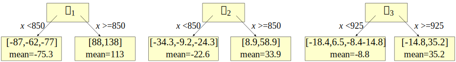

# How to understand gradient boosting

\author{[Terence Parr](http://parrt.cs.usfca.edu) and [Jeremy Howard](http://www.fast.ai/about/#jeremy)}

\preabstract{
(We teach in University of San Francisco's [MS in Data Science program](https://www.usfca.edu/arts-sciences/graduate-programs/data-science) and have other nefarious projects underway. You might know Terence as the creator of the [ANTLR parser generator](http://www.antlr.org). Jeremy is a founding researcher at [fast.ai](http://fast.ai), a research institute dedicated to making deep learning more accessible.)
}

[Gradient boosting machines](https://en.wikipedia.org/wiki/Gradient_boosting) (GBMs) are currently very popular and so it's a good idea for machine learning practitioners to understand how GBMs work. The problem is that understanding all of the mathematical machinery is tricky and, unfortunately, these details are needed to tune the hyper parameters. (Tuning the hyper parameters is needed to getting a decent GBM model unlike, say, Random Forests.)  

To get started, those with very strong mathematical backgrounds can go directly to the super-tasty 1999 paper by Jerome Friedman called [Greedy Function Approximation: A Gradient Boosting Machine](https://statweb.stanford.edu/~jhf/ftp/trebst.pdf).  To get the practical and implementation perspective, though, I recommend Ben Gorman's excellent blog [A Kaggle Master Explains Gradient Boosting](http://blog.kaggle.com/2017/01/23/a-kaggle-master-explains-gradient-boosting/) and Prince Grover's [Gradient Boosting from scratch](https://medium.com/mlreview/gradient-boosting-from-scratch-1e317ae4587d) (written by a [data science](https://www.usfca.edu/arts-sciences/graduate-programs/data-science) graduate student at the University of San Francisco).

Figuring out the details enough to effectively use GBM takes a bit of time but clicks after a few days of reading. Explaining it to somebody else is vastly more difficult.  Students ask the most natural but hard-to-answer questions:

<ol>
	<li>Why is it called *gradient* boosting?		
	<li>What is "function space"?
	<li>Why is it called "gradient descent in function space"?
</ol>

The third question is the hardest to explain. As Gorman points out, "*This is the part that gets butchered by a lot of gradient boosting explanations*." (His blog post does a good job of explaining it, but I thought I would give my own perspective here.)

My goal in this article is not to explain how GBM works *per se*, but rather how to explain the tricky bits to students or other programmers.  I will assume readers are programmers, have a basic grasp of boosting already, can remember high school algebra, and have some minimal understanding of function derivatives (as one might find in the first semester of calculus).[review]

\sidenote[review]{To brush up on your vectors and derivatives, you can check out [The Matrix Calculus You Need For Deep Learning](http://parrt.cs.usfca.edu/doc/matrix-calculus/index.html) written with [Jeremy Howard](http://www.fast.ai/about/#jeremy).}

GBM is based upon the notion of boosting so let's start by getting a feel for how assembling a bunch of weak learners can lead to a strong model.

## A review of boosted regression

[Boosting](https://en.wikipedia.org/wiki/Boosting_\(meta-algorithm\)) is a loosely-defined strategy for combining the efforts of multiple weak models into a single, strong meta-model or composite model.   Mathematicians represent both the weak and composite models as functions. Given a single feature vector $\vec x$ and target value $y$ from a single observation, we can express a meta-model that predicts $\hat y$ as the addition of $M$ weak models, $f_i(\vec x)$:

\[
\hat y = F_M(\vec x) = f_1(\vec x) + ...  + f_M(\vec x) = \sum_{i=1}^M f_i(\vec x)
\]

In practice, we always have more than one observation, ($\vec x_i$, $y_i$), but it's easier to start out thinking about how to deal with a single observation. Later, we'll stack $n$ feature vectors as rows in a matrix, $X = [\vec x_1, \vec x_2, ..., \vec x_n]$, and targets into a vector, $\vec y = [y_1, y_2, ..., y_n]$.

The form of $f_i(\vec x)$ functions we use for the weak models is often the same and the terms of $F_M(\vec x)$ differ only by a scale factor so it's convenient to add a scale term to the equation:

\[
\hat y = F_M(\vec x) = w_1 f_1(\vec x) + ...  + w_M f_M(\vec x) = \sum_{i=1}^M w_i f_i(\vec x)
\]

Mathematicians call this "additive modeling" and electrical engineers use it for decomposing signals into a collection of sine waves representing the frequency components (insert terrifying flashback to Fourier analysis here.) 

It's often the case that an additive model can build the individual $f_i(\vec x)$ terms independently and in parallel, but that's not the case for boosting. Boosting constructs and adds weak models in a stage-wise fashion, one after the other, each one chosen to improve the overall model performance. The boosting strategy is greedy in the sense that choosing $f_i(\vec x)$ and $w_i$ never alters previous weights and functions. We can stop adding weak models when $\hat y = F_M(\vec x)$'s performance is good enough or when $w_i f_i(\vec x)$ doesn't add anything.  <!-- When we care about distinguishing between the various $\hat y$ for different values of $M$, we can use $\hat y^{(i)}$ to represent $F_i(\vec x)$. (We can't use the simpler notation $\hat y_i$ because that means target value $i$ within the $\hat {\vec y}$ vector.)-->

Because greedy strategies choose one component model at a time, you will often see boosting models expressed using this equivalent, recursive formulation:

\[
F_i(\vec x) = F_{i-1} + w_i f_i(\vec x)
\]

Boosting itself does not specify how to choose the weights, the weak learners, or the number of models, $M$.   Boosting does not even specify the form of the $f_i(\vec x)$ models, which can be placeholders for linear regression models, regression trees, or any other model we want.  The form of the weak model dictates the form of the meta-model. For example, if all weak models are linear models, then the resulting meta-model is a simple linear model. If we use tiny regression trees as the weak models, the result is a forest of trees whose predictions are added together.

Let's see if we can design a strategy for picking weak models to create our own boosting algorithm for a single observation. Then, we can extend it to work on the multiple observations we'd encounter in practice.

## The intuition behind gradient boosting

To construct a boosted regression model, let's start by creating a crappy model, $f_0(\vec x)$, that predicts an initial approximation of $y$ given feature vector $\vec x$. Then, let's gradually nudge the overall $F_M(\vec x)$ model towards the known target value $y$ by adding one or more scaled tweaks, $w_i \Delta_i(\vec x)$:

\latex{{
\begin{eqnarray*}
\hat y & = & f_0(\vec x) + w_1 \Delta_1(\vec x) + w_2 \Delta_2(\vec x) + ...  + w_M \Delta_M(\vec x) \\
 & = & f_0(\vec x) + \sum_{i=1}^M w_i \Delta_i(\vec x)\\
 & = & F_M(\vec x)\\
\end{eqnarray*}
}}

Or, using a recurrence relation, let:

\latex{{
\begin{eqnarray*}
F_0(\vec x) &=& f_0(\vec x)\\
F_i(\vec x) &=& F_{i-1}(\vec x) + w_i \Delta_i(\vec x)\\
\end{eqnarray*}
}}

It might be helpful to think of this boosting approach as a golfer initially whacking a golf ball towards the hole at $y$ but only getting as far as $f_0(\vec x)$. The golfer[clipart] then repeatedly taps the ball more softly, working the ball towards the hole, after reassessing direction and distance to the hole at each stage. The following diagram illustrates 5 strokes getting to  the hole, $y$, including two strokes, $\Delta_2$ and $\Delta_3$, that overshoot the hole.

\sidenote[clipart]{Golfer clipart from http://etc.usf.edu/clipart/}

After the initial stroke, the golfer determines the appropriate nudge by computing the  difference between $y$ and the first approximation, $y - F_0(\vec x)$. (We can let $\vec x$ be the hole number 1-18, but it doesn't really matter since we're only working with one observation for illustration purposes.) This difference is often called the *residual*, but it's more general for gradient boosting to think of this as the *direction vector* from the current $\hat y$, $F_i(\vec x)$, to the true $y$.   Using the direction vector as our nudge, means training $\Delta_i (\vec x)$ on value $y - F_{i-1}(\vec x)$ for our base weak models.  As with any machine learning model, our $\Delta_i$ models will not have perfect recall and precision, so we should expect $\Delta_i$ to give a noisy prediction instead of exactly $y - F_{i-1}(\vec x)$. 

As an example, let's say that the hole is at $y$=100 yards, $f_0(\vec x)=70$, and all of our weights are $w_i = 1$. Manually boosting, we might see a sequence like the following, depending on the imprecise $\Delta_i$ strokes made by the golfer:

\latex{{
{\small
\begin{tabular}[t]{llll}
{\bf Boosted}&{\bf Model}&{\bf Train} $\Delta_i$&{\bf Noisy}\\
{\bf Model} & {\bf Output} $\hat y$ & {\bf on} $y - \hat y$ & {\bf Prediction} $\Delta_i$\\
\hline
$F_0$ & 70 & 100-70=30 & $\Delta_1$ = 15\\
$F_1 = F_0 + \Delta_1$ & 70+15=85 & 100-85=15 & $\Delta_2$ = 20 \\
$F_2 = F_1 + \Delta_2$ & 85+20=105 & 100-105={\bf -5} & $\Delta_3$ = {\bf -10} \\
$F_3 = F_2 + \Delta_3$ & 105-10=95 & 100-95=5 & $\Delta_4$ = 5 \\
$F_4 = F_3 + \Delta_4$ & 95+5=100 & &  \\
\end{tabular}
}
}}

A GBM implementation would have to choose weights, $w_i$, appropriately to make sure $\hat y$ converges on $y$ instead of oscillating back and forth forever, among other things. An overall learning rate variable is also typically used to speed up or slow down the overall approach of $\hat y$ to $y$, which also helps to alleviate oscillation. (We want the jumps to shorten as we approach.)

To show how flexible this technique is, consider training the weak models on just the direction of $y$, rather than the magnitude and direction of $y$. In other words, we would train the $\Delta_i (\vec x)$ on $sign(y - \hat y)$, not $y - \hat y$. The $sign(z)$ function expresses the direction as one of $\{-1, 0, +1\}$. We'd have to change how we pick the weights, but both $sign(y - \hat y)$ and $y - \hat y$ point us in the right direction. 

For the single observation case, both final $F_M$ models would converge to the same value, but that's not the case for multiple observations. In the general case, these two direction vector definitions lead the overall model to converge on different predicted target $\hat {\vec y}$ columns; naturally, their hops through the predicted values would also be different. Later, we'll show that these two direction vector definitions are optimizing different measures of model performance.

If you understand this golfer example, then you understand the key intuition behind boosting for regression, at least for a single observation.  Yup, that's it. Of course, we don't have the tools yet to prove this model converges on a useful approximation $\hat y$ or even that it terminates, but we wanted to show that the GBM idea itself is not hard to grok.

There are several things to reinforce before moving on:

<ul>
	<li>The weak models learn direction **vectors**, not just magnitudes.
	<li>The initial model $f_0(\vec x)$ is trying to learn $y$ given $\vec x$, but the $\Delta_i (\vec x)$ tweaks are trying to learn direction vectors given $\vec x$.
	<li>All weak models, $f_0(\vec x)$ and $\Delta_i(\vec x)$, train on the original feature vector $\vec x$.
	<li>Two common direction vector choices are $sign(y-F_{i-1}(\vec x))$ and $y-F_{i-1}(\vec x)$.
</ul>

Let's walk through a concrete example to see what gradient boosting looks like on more than one observation.

## Applying gradient boosting to sample data

Imagine that we have square footage data on five apartments and their rent prices in dollars per month as our training data:

<pyeval label="examples" hide=true>
import pandas as pd
import matplotlib.pyplot as plt
from matplotlib import rc
import matplotlib
import numpy as np
from scipy.optimize import minimize_scalar
from sklearn.metrics import mean_squared_error, mean_absolute_error
#rc('text', usetex=True)
matplotlib.rcParams['mathtext.fontset'] = 'cm'
matplotlib.rcParams['mathtext.rm'] = 'serif'
matplotlib.rc('xtick', labelsize=13) 
matplotlib.rc('ytick', labelsize=13) 

bookcolors = {'crimson': '#a50026', 'red': '#d73027', 'redorange': '#f46d43',
              'orange': '#fdae61', 'yellow': '#fee090', 'sky': '#e0f3f8', 
              'babyblue': '#abd9e9', 'lightblue': '#74add1', 'blue': '#4575b4',
              'purple': '#313695'}
# can't end with quote
</pyeval>

<pyeval label="examples" output="df" hide=true>
def data():
    df = pd.DataFrame(data={"sqfeet":[700,950,800,900,750]})
    df["rent"] = pd.Series([1125,1350,1135,1300,1150])
    df = df.sort_values('sqfeet')
    return df

df = data()
</pyeval>

where row $i$ is an observation with feature vector $\vec x_i$ (bold $\vec x$) and target value $y_i$; vector $\vec y$ (bold $\vec y$) is the entire `rent` column.

From this data, we'd like to build a GBM to predict rent price given square footage. Let's use the mean (average) of the rent prices as the initial model: $F_0(\vec x)$ = $f_0(\vec x)$ = 1200.

My $\eta$ is .75.

<pyeval label="examples" hide=true>
def stub_predict(x_train, y_train, split):
    left = y_train[x_train<split]
    right = y_train[x_train>split]
    lmean = np.mean(left)
    rmean = np.mean(right)    
    return [lmean if x<split else rmean for x in x_train]

eta = 0.75
splits = [None,850, 850, 925] # manually pick them
stages = 4

def boost(df, xcol, ycol, splits, eta, stages):
    """
    Update df to have direction_i, delta_i, F_i.
    Return MSE, MAE
    """
    f0 = df[ycol].mean()
    df['F0'] = f0

    for s in range(1,stages):
        df[f'dir{s}'] = df[ycol] - df[f'F{s-1}']
        df[f'delta{s}'] = stub_predict(df[xcol], df[f'dir{s}'], splits[s])
        df[f'F{s}'] = df[f'F{s-1}'] + eta * df[f'delta{s}']

    mse = [mean_squared_error(df[ycol], df['F'+str(s)]) for s in range(stages)]
    mae = [mean_absolute_error(df[ycol], df['F'+str(s)]) for s in range(stages)]
    return mse, mae

mse,mae = boost(df, 'sqfeet', 'rent', splits, eta, stages)
</pyeval>

<pyeval label="examples" hide=true>
# manually print table in python
# for small phone, make 2 tables
for i in range(len(df)):
    print( " & ".join([f"{int(v)}" for v in df.iloc[i,0:4]]), r"\\")

print
for i in range(len(df)):
    print( " & ".join([f"{int(v)}" for v in df.iloc[i,4:]]), r"\\")
	
print("F0 MSE", mean_squared_error(df.rent, df.F0), "MAE", mean_absolute_error(df.rent, df.F0))
print("F1 MSE", mean_squared_error(df.rent, df.F1), "MAE", mean_absolute_error(df.rent, df.F1))
print("F2 MSE", mean_squared_error(df.rent, df.F2), "MAE", mean_absolute_error(df.rent, df.F2))
print("F3 MSE", mean_squared_error(df.rent, df.F3), "MAE", mean_absolute_error(df.rent, df.F3))
</pyeval>

\latex{{
{\small
\begin{tabular}[t]{rrrr}
{\bf sqfeet} & {\bf rent} & $F_0$ & $y-F_0$ \\
\hline
700 & 1125 & 1212 & -87 \\
750 & 1150 & 1212 & -62 \\
800 & 1135 & 1212 & -77 \\
900 & 1300 & 1212 & 88 \\
950 & 1350 & 1212 & 138 \\
\end{tabular}
}
}}

\latex{{
{\small
\begin{tabular}[t]{rrrrrrrr}
$\Delta_1$ & $F_1$ & $y-F_1$ & $\Delta_2$ & $F_2$ & $y - F_2$ & $\Delta_3$ & $F_3$\\
\hline
-75 & 1155 & -30 & -18 & 1141 & -16 & -8 & 1135 \\
-75 & 1155 & -5 & -18 & 1141 & 8 & -8 & 1135 \\
-75 & 1155 & -20 & -18 & 1141 & -6 & -8 & 1135 \\
113 & 1296 & 3 & 28 & 1317 & -17 & -8 & 1311 \\
113 & 1296 & 53 & 28 & 1317 & 32 & 32 & 1341 \\
\end{tabular}
}
}}

<pyfig label=examples hide=true width="35%">
f0 = df.rent.mean()
fig, ax = plt.subplots(nrows=1, ncols=1, figsize=(4, 2.5), sharex=True)
plt.tight_layout()
ax.plot(df.sqfeet,df.rent,'o', linewidth=.8, markersize=4)
ax.plot([df.sqfeet.min()-10,df.sqfeet.max()+10], [f0,f0],
         linewidth=.8, linestyle='--', c='k')
ax.set_xlim(df.sqfeet.min()-10,df.sqfeet.max()+10)
ax.text(815, f0+15, r"$f_0({\bf x})$", fontsize=20)

ax.set_ylabel(r"Rent $y$", fontsize=20)
ax.set_xlabel(r"${\bf x}$", fontsize=20)

# draw arrows
for x,y,yhat in zip(df.sqfeet,df.rent,df.F0):
    if y-yhat!=0:
        ax.arrow(x, yhat, 0, y-yhat,
                  length_includes_head=True,
                  fc='r', ec='r',
                  linewidth=0.8,
                  head_width=4, head_length=15,  
                 )

plt.show()
</pyfig>

<pyfig label=examples hide=true width="100%">
def draw_stub(ax, x_train, y_train, y_pred, split, stage):
    line1, = ax.plot(x_train, y_train, 'o',
                     markersize=4,
                     label=f"$y-\\hat F_{stage-1}$")
    label = r"$\Delta_"+str(stage)+r"({\bf x})$"
    left = y_pred[x_train<split]
    right = y_pred[x_train>split]
    lmean = np.mean(left)
    rmean = np.mean(right)
    line2, = ax.plot([x_train.min()-10,split], [lmean,lmean],
             linewidth=.8, linestyle='--', c='k', label=label)
    ax.plot([split,x_train.max()+10], [rmean,rmean],
             linewidth=.8, linestyle='--', c='k')
    ax.plot([split,split], [lmean,rmean],
             linewidth=.8, linestyle='--', c='k')
    ax.legend(handles=[line1,line2], fontsize=16,
              loc='upper left', 
              labelspacing=.1,
              handletextpad=.2,
              handlelength=.7,
              frameon=True)

def draw_residual(ax, x_train, y_train, y_hat):
    for x,y,yhat in zip(x_train, y_train, y_hat):
        if y-yhat!=0:
            ax.arrow(x, yhat, 0, y-yhat,
                      length_includes_head=True,
                      fc='r', ec='r',
                      linewidth=0.8,
                     )

fig, axes = plt.subplots(nrows=1, ncols=3, figsize=(10, 3.5), sharey=True)

axes[0].set_ylabel(r"$y-\hat y$", fontsize=20)
for a in range(3):
    axes[a].set_xlabel(r"${\bf x}$", fontsize=20)
    
draw_stub(axes[0], df.sqfeet, df.dir1, df.delta1, splits[1], stage=1)
draw_residual(axes[0], df.sqfeet,df.dir1,df.delta1)

draw_stub(axes[1], df.sqfeet, df.dir2, df.delta2, splits[2], stage=2)
draw_residual(axes[1], df.sqfeet,df.dir2,df.delta2)

draw_stub(axes[2], df.sqfeet, df.dir3, df.delta3, splits[3], stage=3)
draw_residual(axes[2], df.sqfeet,df.dir3,df.delta3)

plt.tight_layout()
plt.show()
</pyfig>

<pyeval label="examples" hide=true>
# Compute MSE
stages = 4
df = data() # fresh data

df_mse = pd.DataFrame(data={"stage":range(stages)})

for eta in np.arange(.5, 1, .1):
    mse,mae = boost(df, 'sqfeet', 'rent', splits, eta, stages)
    df_mse[f'mse_{eta:.2f}'] = mse

mse = [mean_squared_error(df.rent, df[f'F{s}']) for s in range(4)]
df_mse
</pyeval>

<pyfig label=examples hide=true width="45%">
fig, ax = plt.subplots(nrows=1, ncols=1, figsize=(6, 4), sharex=True)

maxy = 1500

mins = []
for eta in np.arange(.5, 1, .1):
    mins.append( np.min(df_mse[f'mse_{eta:.2f}']) )

min_eta_index = np.argmin(mins)

i = 0
for eta in np.arange(.5, 1, .1):
    color = 'grey'
    lw = .8
    ls = ':'
    if i==min_eta_index:
        color = bookcolors['blue']
        lw = 1.7
        ls = '-'
    ax.plot(df_mse.stage,df_mse[f'mse_{eta:.2f}'],
            linewidth=lw,
            linestyle=ls,
            c=color)
    xloc = 1.2
    yloc = (df_mse[f'mse_{eta:.2f}'].values[1] + df_mse[f'mse_{eta:.2f}'].values[2])/2
    if yloc>maxy:
        yloc = maxy-100
        xloc +=  .5
    ax.text(xloc, yloc, f"$\\eta={eta:.1f}$",
            fontsize=16)
    i += 1

plt.axis([0,stages-1,0,maxy])

ax.set_ylabel(r"Mean Squared Error", fontsize=16)
ax.set_xlabel(r"Number of stages $M$", fontsize=16)
ax.set_title(r'Effect of learning rate $\eta$ on MSE of $F_M({\bf x})$', fontsize=16)
ax.set_xticks(range(0,stages))

plt.tight_layout()
plt.show()
</pyfig>

<pyeval label=examples hide=true>
eta = 0.7
df = data()
mse,mae = boost(df, 'sqfeet', 'rent', splits, eta, stages)
df['deltas'] = eta * df[['delta1','delta2','delta3']].sum(axis=1) # sum deltas
df[['sqfeet','rent','F0','delta1','delta2','delta3','deltas']]
</pyeval>

<pyfig label=examples hide=true width="45%">
# Hideous manual computation of composite graph but...

fig, ax = plt.subplots(nrows=1, ncols=1, figsize=(6.1, 3))

# plot deltas
line1, = ax.plot(df.sqfeet,df.dir1, 'o', label=r'$y-f_0$')

prevx = np.min(df.sqfeet)
prevy = 0
splitys = []
for s in splits[1:]:
    if s>prevx: # ignore splits at same spot for plotting
        y = np.mean(df.deltas[(df.sqfeet>prevx)&(df.sqfeet<=s)]) # all same, get as one
        splitys.append(y)
        #print(prevx,s,"=>",y)
        ax.plot([prevx,s], [y,y], linewidth=.8, linestyle='--', c='k')
    # draw verticals
    prevx = s
    prevy = y

last = np.max(df.sqfeet)
y = np.mean(df.deltas[(df.sqfeet>prevx)&(df.sqfeet<=last)]) # all same, get as one
#print(prev,last,"=>",y)
splitys.append(y)
line2, = ax.plot([prevx,last], [y,y], linewidth=.8, linestyle='--', c='k',
                label=r"$\eta (\Delta_1+\Delta_2+\Delta_3)$")

ax.plot([splits[1],splits[1]], [splitys[0], splitys[1]], linewidth=.8, linestyle='--', c='k')
ax.plot([splits[3],splits[3]], [splitys[1], splitys[2]], linewidth=.8, linestyle='--', c='k')
ax.plot([s,s], [prevy,y], linewidth=.8, linestyle='--', c='k')

ax.set_ylabel(r"Sum $\Delta_i$ models", fontsize=16)
ax.set_xlabel(r"${\bf x}$", fontsize=20)

ax.set_yticks([-100,-50,0,50,100,150])

ax.legend(handles=[line1,line2], fontsize=16,
          loc='upper left', 
          labelspacing=.1,
          handletextpad=.2,
          handlelength=.7,
          frameon=True)

plt.tight_layout()
plt.show()
</pyfig>
	
<pyfig label=examples hide=true width="45%">
# Hideous manual computation of composite graph but...

fig, ax = plt.subplots(nrows=1, ncols=1, figsize=(6.1, 3))

# plot deltas
line1, = ax.plot(df.sqfeet,df.rent, 'o', label=r'$y$')

prevx = np.min(df.sqfeet)
prevy = df.F0
splitys = []
for s in splits[1:]:
    if s>prevx: # ignore splits at same spot for plotting
        y = np.mean(df.F0+df.deltas[(df.sqfeet>prevx)&(df.sqfeet<=s)]) # all same, get as one
        splitys.append(y)
        #print(prevx,s,"=>",y)
        ax.plot([prevx,s], [y,y], linewidth=.8, linestyle='--', c='k')
    # draw verticals
    prevx = s
    prevy = y

last = np.max(df.sqfeet)
y = np.mean(df.F0+df.deltas[(df.sqfeet>prevx)&(df.sqfeet<=last)]) # all same, get as one
#print(prev,last,"=>",y)
splitys.append(y)
line2, = ax.plot([prevx,last], [y,y], linewidth=.8, linestyle='--', c='k',
                label=r"$f_0 + \eta (\Delta_1+\Delta_2+\Delta_3)$")

ax.plot([splits[1],splits[1]], [splitys[0], splitys[1]], linewidth=.8, linestyle='--', c='k')
ax.plot([splits[3],splits[3]], [splitys[1], splitys[2]], linewidth=.8, linestyle='--', c='k')
ax.plot([s,s], [prevy,y], linewidth=.8, linestyle='--', c='k')

ax.set_ylabel(r"Rent", fontsize=16)
ax.set_xlabel(r"${\bf x}$", fontsize=20)

ax.set_yticks(np.arange(1150,1351,50))

ax.legend(handles=[line1,line2], fontsize=16,
          loc='upper left', 
          labelspacing=.1,
          handletextpad=.2,
          handlelength=.7,
          frameon=True)

plt.tight_layout()
plt.show()
</pyfig>
	
Now show MSE, MAE

Now show addition of all terms, dsashed lines, visually.

$\hat y = f_0(\vec x) + \Delta_1(\vec x) + \Delta_2(\vec x) + ...  + \Delta_M(\vec x)$

That's easy enough, so what's the problem? How do we know this procedure is correct and terminates? Why do they call it gradient boosting?

we add together the results of multiple weak learners

How good is that model? To answer that, we need a loss or cost function, $L(y,\hat y)$, that computes the cost of predicting $\hat y$ instead of $y$.  The squared error, $L(y,\hat y) = (y-\hat y)^2$ is the most common, but sometimes we care more about the absolute difference, $L(y,\hat y) = |y-\hat y|$. The loss across all observations is just the sum (or the average if you want to divide by $n$) of all the individual observation losses:

\[
L(\vec y, X) = \sum_{i=1}^{n} L(y_i, F_M(\vec x_i))
\]

That gives this either $L(\vec y, X) = \sum_{i=1}^{n} (y_i - F_M(\vec x_i))^2$ or $L(\vec y, X) = \sum_{i=1}^{n} |y_i - F_M(\vec x_i)|$.

Have you ever wondered why this technique is called *gradient* boosting? We're boosting gradients because our weak models learn direction vectors, and the other common term for "direction vector" is, drumroll please, *gradient*.  that leads us to optimization via gradient descent.

## The intuition behind gradient descent

what's a gradient?

we would choose absolute value difference when we are worried about outliers.

gradient descent does parameter optimization normally but we are now doing function space optimization. Gradient descent can't be doing parameter optimization because the different kinds of models would have different parameters.

 picking weights is also an optimization problem.

Conceptually, gradient boosting is pretty easy to explain

Given $(X, \vec y)$ we want an $f(X)$ $f(X_i) = y_i$.

$\vec y = f(X)$

Treating a gradient boosting machine means an initial approximation to the target and then multiple trainings for models that map the x to a nudge.

typical use a gradient boosting is to use a single function that represents the model mapping predictors to target, such as  logistic regression or neural networks. In that case, we are tweaking the models to see how the resulting function output affects the cost function. With gradient boosting, we have multiple functions not just one. Of course when we train each model/function we must do some model-parameter fitting to learn, but that is a totally separate concept.  With gradient boosting, we are not tweaking the parameters of a single function but instead are asking how to tweak the output from a composite function. Each new tweak gets added into the composite function.

Game of golf. hit it once to get it close then nudge, nudge, nudge to get into hole.

$Cost(y, \hat y_0 + \Delta y_1 + \Delta y_2 + ...  + \Delta y_M)$.

$F_0(x) = \hat y$

$F_1(x) = \hat y + \Delta y_1$

$F_2(x) = \hat y + \Delta y_1 + \Delta y_2$

or, instead of nudging along we can try to jump from the initial approximation to the end:

$Cost(y, \hat y + \Delta y)$

The problem is that we can't make the Delta exactly and so we end up with, in both cases,

$Cost(y, \hat y + \hat{\Delta y}_1 + \hat{\Delta y}_2 + ...  + \hat{\Delta y}_M)$.

Want to minimize

$Cost(\vec y, f(X))$

where $f(X)$ is the set of predictions coming from our model $f$. To minimize that, we keep tweaking the parameters of $f$ until we get the minimum cost.  typically we expose those parameters, such as with linear regression model $y = \beta_0 + \beta_1 x$.

$Cost(\vec y, f(X;[\beta_0, \beta_1])$

or

$Cost(\vec y, \beta_0 + \beta_1 x)$

and then say to minimize that equation by shifting $[\beta_0, \beta_1]$ around.
 
$Cost(\vec y, \hat y)$

for some predictions from the model $\hat y$.

The typical iterative update procedure for gradient descent is:

$x_{t+1} = x_t - \eta \nabla f(x_t)$

to find $x$ that minimizes $f(x)$.   When using it to train a model, $x$ is the set of parameters for the model. In neural networks, the architecture is embodied by the $f$ function.

pikes peak metaphor: elevation function is model, x is location. shift x until elevation is minimized.  that is one model  called elevation. x is parameter.  with boosting, get a starting elevation (the summit?) then ask which direction we should take a step to head towards lower elevation at a specific x location.  hmm...maybe it's like we know the elevation at bottom, 6000' (vs 14110' at summit).  We ask, is current elevation 6000? No, need another step so drop elevation by 1 unit. this would be simulating one $\vec x$ and one $y$ target...too easy to move one person downhill. but it's like start at some elevation, now go down until bottom (cost is 0 when we reach bottom). duh. ok, extend so there are 20 kids on trip and all at different starting points. Now pretend they are all at average elevation.  Boosting tweaks not the x location of each kid, but sends a "go down or go up or stop moving signal".   The updated prediction of kid elevations is initial guess of average and then tweaks giving instructions to head up/down to reach same base camp at bottom. (some might have gotten lost and ended up below base camp). Hmm...actually, no. we send park rangers, one per kid, starting at basecamp looking to reach each kid. initial guess basecamp.  Then ask for ranger i, is kid i above/below/same. Tell ranger to move. Ranger elevation is initial + all tweaks. when tweak vector goes to all 0s, rangers have reached all kids. how does x location come into play?  training ranger to move elevation up/down might involve shifting in x/y plane to get single elevation value.

## Summary

foo

<aside title="Q. Why is it called >gradient< boosting?">

**A**. We're boosting gradients because the weak models learn direction vectors, and the other common term for "direction vector" is, drumroll please, *gradient*. Yup, simple as that.
</aside>

## Notation translation to Friedman's paper

foo

## Resources

Vincent and Bengio [http://www-labs.iro.umontreal.ca/~vincentp/Publications/kmp_mlj.pdf](http://www-labs.iro.umontreal.ca/~vincentp/Publications/kmp_mlj.pdf)

# Junk drawer

<!--
Let's perform some manual boosting using this diagram as a guide. Let the target $y$ be 100 yards distant from the tee and the initial approximation, $f_0(\vec x)$, be 70 yards: $F_0(\vec x) = f_0(\vec x) = 70$. The golfer still has $y-70 = 30$ yards to go and so we need to boost the current prediction in the positive direction. Let's use $\Delta_1 (\vec x) = 1$ to indicate a positive delta and, to avoid taking forever, let's scale the new weak learner by $w_1 = 10$: $F_1(\vec x) = 70 + 10$. The golfer is still short so we boost again with $\Delta_2 (\vec x) = 1$ and $w_2 = 10$: $F_2(\vec x) = 70 + 10 + 10$. Finally, we get $\hat y = F_3(\vec x) = 70 + 30 + 30 + 30 = 100$. We would not have to the same  weights, but that is convenient and works for this example. We could also use

 a constant amount

\latex{{
\begin{eqnarray*}
F_0 &=& f_0, ~~~~~~~~~~~~~~~~~~~~~y-\hat y = 30 \\
F_1 &=& F_0 + 10 \times 1\\
F_2 &=& F_1 + 10 \times 1\\
F_3 &=& F_2 + 10 \times 1\\
\end{eqnarray*}
}}
-->
